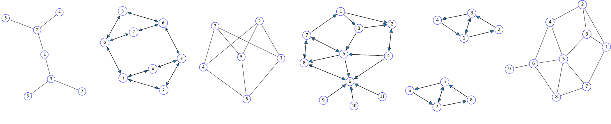

# graphPlot



A python module for plotting (directed) Graphs using a simulation of springs
and charged particles

See [info](https://peterefrancis.github.io/graphPlot/)
 for a **mathematical explanation**, **examples**, and **class definitions**.

You can import this module with PIP.

```bash
$ pip install graphPlot --upgrade
```

or

```bash
$ python3 -m pip install --user graphPlot --upgrade
```


**TODO:**
- [ ] Upgrade to "back-two" approximation in `SpringBoard`
- [ ] Add custom start position to `SpringBoard`
- [ ] Add animation maker
- [ ] Make specific physical examples

**Long term TODO:**
- [ ] Make normalization "less invasive"
- [ ] Cythonize
- [ ] Integrate planarity tests
- [ ] Add add self loop arrows
- [ ] Add curved arrows
- [ ] Add copy constructors
- [ ] Add `__eq__`s for other classes
- [ ] Add `__repr__`s for other classes
- [ ] Check if the check in move() is most effective
