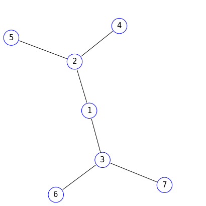
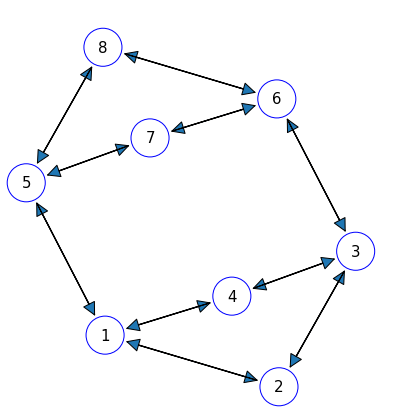
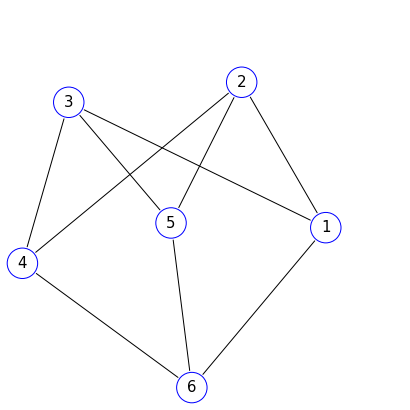
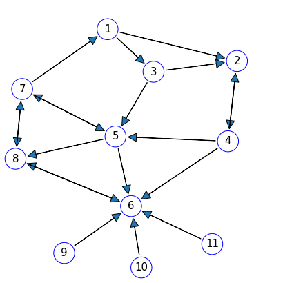
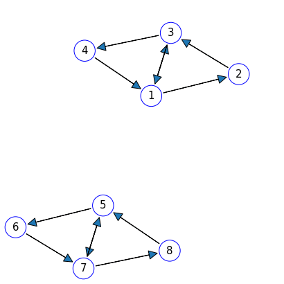
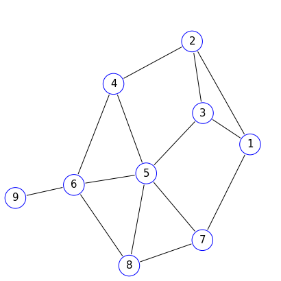

# graphPlot

---
<div>
  <div style="display: inline-block;">
    
  </div>
  <div style="display: inline-block;">
    
  </div>
  <div style="display: inline-block;">
    
  </div>
  <div style="display: inline-block;">
    
  </div>
  <div style="display: inline-block;">
    
  </div>
  <div style="display: inline-block;">
    
  </div>
</div>
---

A python module for plotting (directed) Graphs using a simulation of springs
and charged particles


See [info](https://francisp336.github.io/graphPlot/) for a
**mathematical explanation**, **examples**, and **class definitions**.

You can import this module with PIP.

```bash
$ pip install graphPlot --upgrade
```

or

```bash
$ python3 -m pip install --user graphPlot --upgrade
```


**TODO:**
- [ ] Add `__repr__`s for other classes
- [ ] Add checks in constructors for
